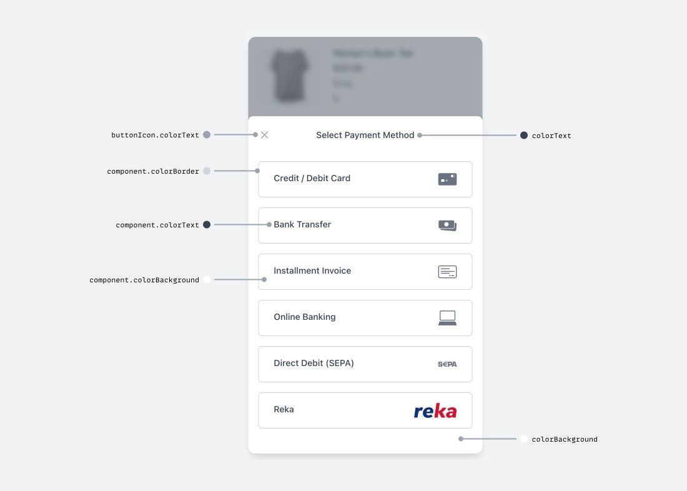
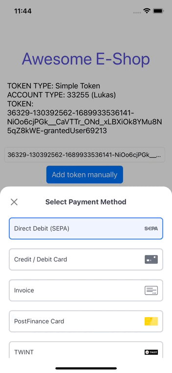
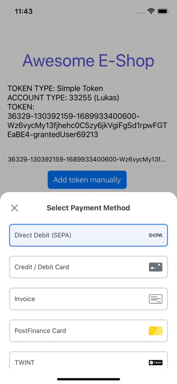

## Theming

- [Theming](#theming)
  - [Colors](#colors)
  - [Animation](#animation)
  - [Default themes](#default-themes)
    - [Light theme](#light-theme)
    - [Dark theme](#dark-theme)

The appearance of the payment dialog can be customized to match the look and feel of your app. This can be done for both the light and dark theme individually.

Colors can be modified by passing a JSON object to the `StagingWalleeSdk` instance. You can either completely override the theme or only change certain colors.

- `StagingWalleeSdk.instance?.setLightTheme(JSONObject)` allows to modify the payment dialog's light theme.
- `StagingWalleeSdk.instance?.setDarkTheme(JSONObject)` allows to modify the payment dialog's dark theme.
- `StagingWalleeSdk.instance?.setCustomTheme(JSONObject, ThemeEnum)` allows to enforce a specific theme (dark, light or your own).

```kotlin
// ...
import io.github.whitelabelgithubownername.enums.ThemeEnum

class MainActivity : AppCompatActivity() {
    // ...

    override fun onCreate(savedInstanceState: Bundle?) {
        super.onCreate(savedInstanceState)
        setContentView(R.layout.activity_main)

        StagingWalleeSdk.instance?.setDarkTheme(getCustomTheme())
        StagingWalleeSdk.instance?.setLightTheme(getCustomTheme())
    }

    fun getCustomTheme(): JSONObject {
        val customTheme = JSONObject()
        customTheme.put("colorBackground", "#ABA2A2")
        customTheme.put("colorText", "#2F4858")
        customTheme.put("colorHeadingText", "#4F5769")
        customTheme.put("colorError", "#998D91")
        return customTheme
    }

    // ...
}
```

This will override the colors `colorBackground`, `colorText`, `colorHeadingText` and `colorError` for both the dark and light theme.

The `setCustomTheme` function allows to define the theme to be used by the payment dialog and prevent it from switching themes based on the user's settings. This way e.g. high- and low-contrast themes can be added. The logic for switching between these themes is up to you though.

```kotlin
// ...
import io.github.whitelabelgithubownername.enums.ThemeEnum

class MainActivity : AppCompatActivity() {
    // ...

    override fun onCreate(savedInstanceState: Bundle?) {
        super.onCreate(savedInstanceState)
        setContentView(R.layout.activity_main)

        StagingWalleeSdk.instance?.setCustomTheme(getCustomTheme(), ThemeEnum.DARK)
    }

    fun getCustomTheme(): JSONObject {
        val customTheme = JSONObject()
        customTheme.put("colorBackground", "#0800FC")
        customTheme.put("colorText", "#EA00B6")
        customTheme.put("colorHeadingText", "#FF0071")
        customTheme.put("colorError", "#FF693E")
        return customTheme
    }

    //...
}
```

You can also use `setCustomTheme` to force the usage of the light or dark theme.

```kotlin
  //...
StagingWalleeSdk.instance?.setCustomTheme(null, ThemeEnum.DARK)
```

### Colors

  

### Animation

Use `setAnimation` method to change the screen change animation. Currently avaliable options are: `AnimationEnum.SLIDE` and `AnimationEnum.BUBBLE`. Default value is `AnimationEnum.SLIDE`. `StagingWalleeSdk.instance?.setAnimation(AnimationEnum.BUBBLE)` allows to modify the payment dialog's dark theme.  

### Default themes

#### Light theme

```json
{
  "colorPrimary": "#3b82f6",
  "colorBackground": "#ffffff",
  "colorText": "#374151",
  "colorSecondaryText": "#6b7280",
  "colorHeadingText": "#111827",
  "colorError": "#ef4444",
  "toast": {
    "border": "#F14D00",
    "background": "#FFF6F6",
    "messageText": "#ef4444"
  },
  "component": {
    "colorBackground": "#ffffff",
    "colorBorder": "#d1d5db",
    "colorText": "#374151",
    "colorPlaceholderText": "#4b5563",
    "colorFocus": "#3b82f6",
    "colorSelectedText": "#1e3a8a",
    "colorSelectedBackground": "#eff6ff",
    "colorSelectedBorder": "#bfdbfe",
    "colorDisabledBackground": "#80808019"
  },
  "buttonPrimary": {
    "colorBackground": "#2563eb",
    "colorText": "#ffffff",
    "colorHover": "#1d4ed8"
  },
  "buttonSecondary": {
    "colorBackground": "#bfdbfe",
    "colorText": "#1d4ed8",
    "colorHover": "#bfdbfe"
  },
  "buttonText": {
    "colorText": "#6b7280",
    "colorHover": "#374151"
  },
  "buttonIcon": {
    "colorText": "#9ca3af",
    "colorHover": "#6b7280"
  }
}
```

#### Dark theme

```json
{
  "colorPrimary": "#3b82f6",
  "colorBackground": "#1f2937",
  "colorText": "#e5e7eb",
  "colorSecondaryText": "#9ca3af",
  "colorHeadingText": "#f9fafb",
  "colorError": "#ef4444",
  "toast": {
    "border": "#F14D00",
    "background": "#222222",
    "messageText": "#ef4444"
  },
  "component": {
    "colorBackground": "#374151",
    "colorBorder": "#6b7280",
    "colorText": "#f3f4f6",
    "colorPlaceholderText": "#9ca3af",
    "colorFocus": "#3b82f6",
    "colorSelectedText": "#f3f4f6",
    "colorSelectedBackground": "#4b5563",
    "colorSelectedBorder": "#9ca3af",
    "colorDisabledBackground": "#9ca3af"
  },
  "buttonPrimary": {
    "colorBackground": "#2563eb",
    "colorText": "#ffffff",
    "colorHover": "#1d4ed8"
  },
  "buttonSecondary": {
    "colorBackground": "#6b7280",
    "colorText": "#f3f4f6",
    "colorHover": "#4b5563"
  },
  "buttonText": {
    "colorText": "#9ca3af",
    "colorHover": "#d1d5db"
  },
  "buttonIcon": {
    "colorText": "#d1d5db",
    "colorHover": "#f3f4f6"
  }
}
```
